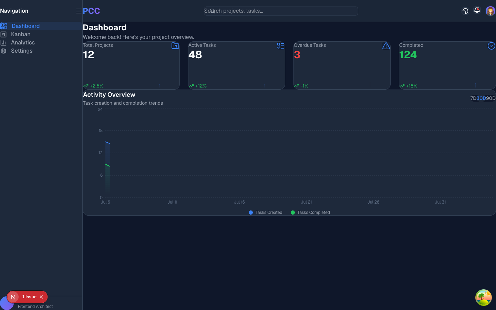
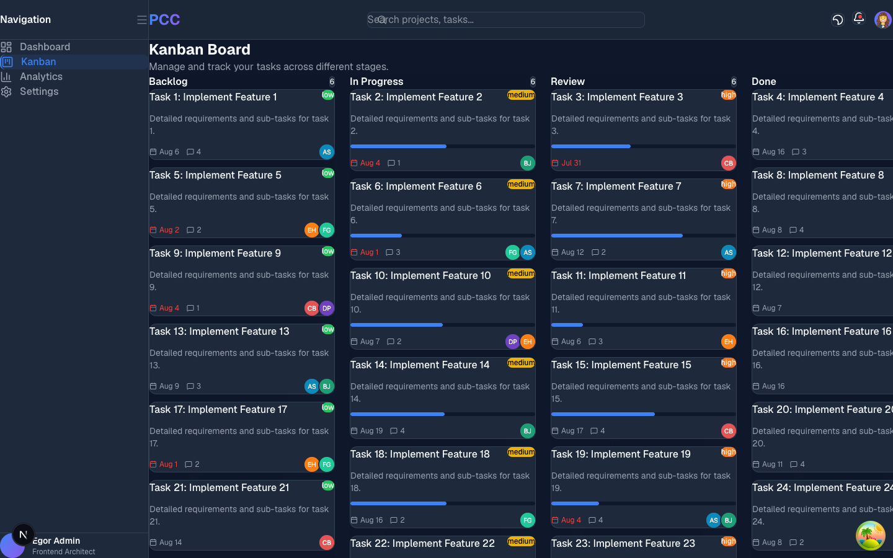
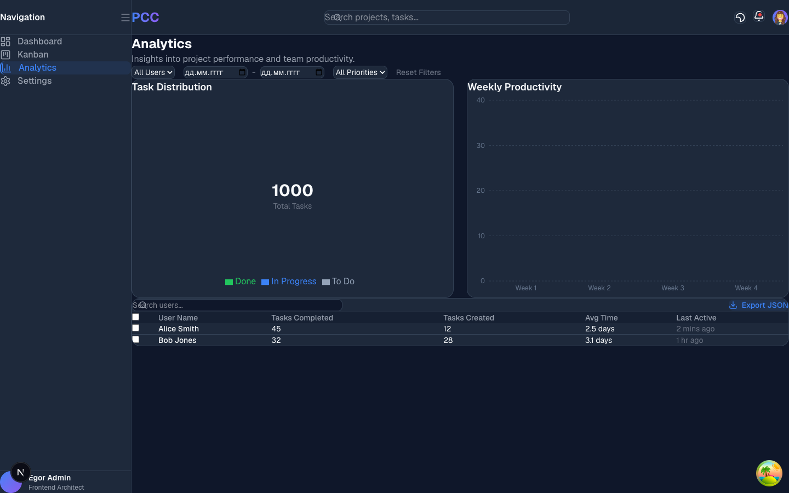
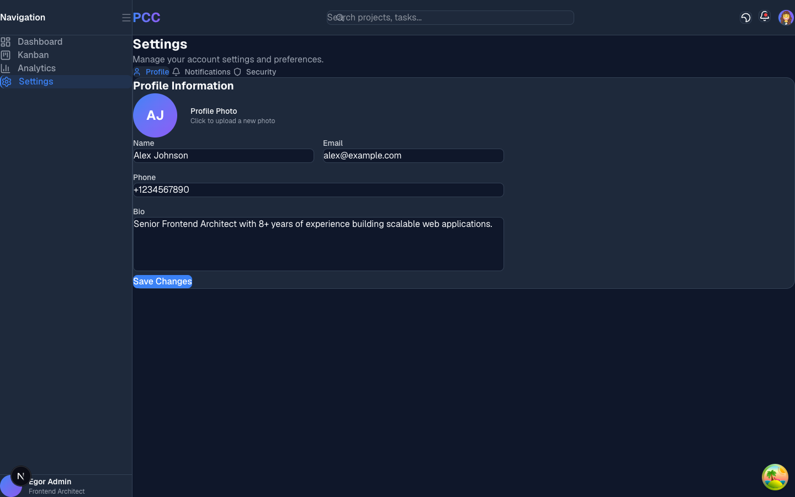
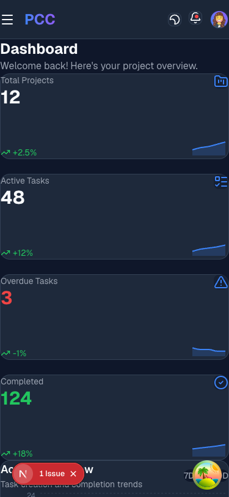

# AUDIT PACKAGE

## 1. Ссылка на деплой
GitHub Repository: [https://github.com/1hote-ai/project-control-center](https://github.com/1hote-ai/project-control-center)
*(Локальный запуск: `npm run start` на порту 3000)*

## 2. Полное дерево проекта
```text
project-control-center
├── AGENTS.md
├── CLAUDE.md
├── README.md
├── REVIEW.md
├── build_fsd.sh
├── eslint.config.mjs
├── next-env.d.ts
├── next.config.ts
├── package-lock.json
├── package.json
├── postcss.config.mjs
├── public
│   ├── file.svg
│   ├── globe.svg
│   ├── next.svg
│   ├── vercel.svg
│   └── window.svg
├── scripts
│   ├── capture.js
│   └── generate-tree.js
├── src
│   ├── app
│   │   ├── (dashboard)
│   │   │   ├── analytics
│   │   │   │   └── page.tsx
│   │   │   ├── kanban
│   │   │   │   └── page.tsx
│   │   │   ├── layout.tsx
│   │   │   ├── page.tsx
│   │   │   └── settings
│   │   │       └── page.tsx
│   │   ├── favicon.ico
│   │   ├── globals.css
│   │   ├── layout.tsx
│   │   └── providers.tsx
│   ├── entities
│   │   ├── analytics
│   │   │   ├── index.ts
│   │   │   └── model
│   │   │       ├── queries.ts
│   │   │       └── store.ts
│   │   ├── project
│   │   │   ├── index.ts
│   │   │   └── model
│   │   │       ├── queries.ts
│   │   │       └── store.ts
│   │   ├── task
│   │   │   ├── index.ts
│   │   │   ├── model
│   │   │   │   ├── queries.ts
│   │   │   │   └── store.ts
│   │   │   └── ui
│   │   │       └── task-card.tsx
│   │   └── user
│   │       ├── index.ts
│   │       └── model
│   │           ├── queries.ts
│   │           └── store.ts
│   ├── features
│   │   ├── kanban
│   │   │   ├── index.ts
│   │   │   └── ui
│   │   │       └── task-modal.tsx
│   │   ├── notifications
│   │   │   ├── index.ts
│   │   │   └── ui
│   │   │       └── notification-bell.tsx
│   │   ├── search
│   │   │   ├── index.ts
│   │   │   └── ui
│   │   │       └── search-bar.tsx
│   │   └── theme-toggle
│   │       ├── index.ts
│   │       └── ui
│   │           └── theme-toggle.tsx
│   ├── shared
│   │   ├── api
│   │   │   ├── index.ts
│   │   │   ├── mock-api.ts
│   │   │   └── mock-data.ts
│   │   ├── config
│   │   │   └── index.ts
│   │   ├── hooks
│   │   │   ├── index.ts
│   │   │   ├── use-debounce.ts
│   │   │   └── use-local-storage.ts
│   │   ├── index.ts
│   │   ├── lib
│   │   │   ├── utils.test.ts
│   │   │   └── utils.ts
│   │   ├── types
│   │   │   └── index.ts
│   │   └── ui
│   │       ├── avatar.tsx
│   │       ├── badge.tsx
│   │       ├── button.tsx
│   │       ├── index.ts
│   │       ├── input.tsx
│   │       ├── modal.tsx
│   │       ├── progress-bar.tsx
│   │       ├── select.tsx
│   │       ├── skeleton.tsx
│   │       ├── textarea.tsx
│   │       └── toast-provider.tsx
│   └── widgets
│       ├── activity-chart
│       │   ├── index.ts
│       │   └── ui
│       │       └── activity-chart.tsx
│       ├── analytics-dashboard
│       │   ├── index.ts
│       │   └── ui
│       │       ├── analytics-filters.tsx
│       │       ├── productivity-chart.tsx
│       │       ├── task-distribution-chart.tsx
│       │       └── user-activity-table.tsx
│       ├── header
│       │   ├── index.ts
│       │   └── ui
│       │       └── header.tsx
│       ├── kanban-board
│       │   ├── index.ts
│       │   └── ui
│       │       ├── kanban-board.tsx
│       │       ├── kanban-column.tsx
│       │       └── sortable-task-card.tsx
│       ├── settings-panel
│       │   ├── index.ts
│       │   └── ui
│       │       ├── notifications-section.tsx
│       │       ├── profile-section.tsx
│       │       └── security-section.tsx
│       ├── sidebar
│       │   ├── index.ts
│       │   └── ui
│       │       └── sidebar.tsx
│       └── stat-cards
│           ├── index.ts
│           └── ui
│               └── stat-cards.tsx
├── structure.txt
├── tsconfig.json
├── tsconfig.tsbuildinfo
├── vitest.config.ts
└── vitest.setup.ts

```

## 3. Вывод команд
### `npm run build`
```text

> project-control-center@0.1.0 build
> next build

▲ Next.js 16.3.0 (Turbopack)
✓ Running next.config.ts took 11ms

  Creating an optimized production build ...
✓ Compiled successfully in 568ms
  Running TypeScript ...
vitest.config.ts(2,19): error TS2307: Cannot find module '@vitejs/plugin-react' or its corresponding type declarations.
Failed to type check.


```

### `npm run lint`
```text

> project-control-center@0.1.0 lint
> eslint


/Users/egor/Desktop/1 тз/project-control-center/scripts/generate-tree.js
  1:12  error  A `require()` style import is forbidden  @typescript-eslint/no-require-imports
  2:14  error  A `require()` style import is forbidden  @typescript-eslint/no-require-imports

/Users/egor/Desktop/1 тз/project-control-center/src/entities/task/ui/task-card.tsx
  88:17  warning  Using `` could result in slower LCP and higher bandwidth. Consider using `<Image />` from `next/image` or a custom image loader to automatically optimize images. This may incur additional usage or cost from your provider. See: https://nextjs.org/docs/messages/no-img-element  @next/next/no-img-element

/Users/egor/Desktop/1 тз/project-control-center/src/features/kanban/ui/task-modal.tsx
   5:10  warning  'motion' is defined but never used                                                                                                                                                                                                                                                                                                                                                                                                                                                                                                                                                                                                                                                                                                                                                                                                                                                                                                                                                                                                                                                                                          @typescript-eslint/no-unused-vars
  39:7   error    Error: Calling setState synchronously within an effect can trigger cascading renders

Effects are intended to synchronize state between React and external systems such as manually updating the DOM, state management libraries, or other platform APIs. In general, the body of an effect should do one or both of the following:
* Update external systems with the latest state from React.
* Subscribe for updates from some external system, calling setState in a callback function when external state changes.

Calling setState synchronously within an effect body causes cascading renders that can hurt performance, and is not recommended. (https://react.dev/learn/you-might-not-need-an-effect).

/Users/egor/Desktop/1 тз/project-control-center/src/features/kanban/ui/task-modal.tsx:39:7
  37 |   useEffect(() => {
  38 |     if (selectedTask) {
> 39 |       setFormData({
     |       ^^^^^^^^^^^ Avoid calling setState() directly within an effect
  40 |         title: selectedTask.title,
  41 |         description: selectedTask.description,
  42 |         status: selectedTask.status,  react-hooks/set-state-in-effect

/Users/egor/Desktop/1 тз/project-control-center/src/features/search/ui/search-bar.tsx
  7:10  warning  'debouncedQuery' is assigned a value but never used  @typescript-eslint/no-unused-vars

/Users/egor/Desktop/1 тз/project-control-center/src/features/theme-toggle/ui/theme-toggle.tsx
  12:5  error  Error: Calling setState synchronously within an effect can trigger cascading renders

Effects are intended to synchronize state between React and external systems such as manually updating the DOM, state management libraries, or other platform APIs. In general, the body of an effect should do one or both of the following:
* Update external systems with the latest state from React.
* Subscribe for updates from some external system, calling setState in a callback function when external state changes.

Calling setState synchronously within an effect body causes cascading renders that can hurt performance, and is not recommended. (https://react.dev/learn/you-might-not-need-an-effect).

/Users/egor/Desktop/1 тз/project-control-center/src/features/theme-toggle/ui/theme-toggle.tsx:12:5
  10 |
  11 |   useEffect(() => {
> 12 |     setMounted(true);
     |     ^^^^^^^^^^ Avoid calling setState() directly within an effect
  13 |     const root = document.documentElement;
  14 |     if (theme === 'dark') {
  15 |       root.classList.add('dark');  react-hooks/set-state-in-effect

/Users/egor/Desktop/1 тз/project-control-center/src/shared/api/mock-api.ts
  15:5  error  'projects' is never reassigned. Use 'const' instead       prefer-const
  17:5  error  'notifications' is never reassigned. Use 'const' instead  prefer-const

/Users/egor/Desktop/1 тз/project-control-center/src/shared/api/mock-data.ts
  2:10  warning  'generateId' is defined but never used  @typescript-eslint/no-unused-vars

/Users/egor/Desktop/1 тз/project-control-center/src/shared/lib/utils.ts
  88:46  error  Unexpected any. Specify a different type  @typescript-eslint/no-explicit-any
  88:56  error  Unexpected any. Specify a different type  @typescript-eslint/no-explicit-any

/Users/egor/Desktop/1 тз/project-control-center/src/shared/ui/avatar.tsx
  25:9  warning  Using `` could result in slower LCP and higher bandwidth. Consider using `<Image />` from `next/image` or a custom image loader to automatically optimize images. This may incur additional usage or cost from your provider. See: https://nextjs.org/docs/messages/no-img-element  @next/next/no-img-element

/Users/egor/Desktop/1 тз/project-control-center/src/widgets/activity-chart/ui/activity-chart.tsx
   3:10  warning  'useState' is defined but never used                                                                                                                                                                                                                                                                                                                                                                                                                                                                                                                                                                                                                                                                                                                                                                                  @typescript-eslint/no-unused-vars
   5:3   warning  'LineChart' is defined but never used                                                                                                                                                                                                                                                                                                                                                                                                                                                                                                                                                                                                                                                                                                                                                                                 @typescript-eslint/no-unused-vars
   6:3   warning  'Line' is defined but never used                                                                                                                                                                                                                                                                                                                                                                                                                                                                                                                                                                                                                                                                                                                                                                                      @typescript-eslint/no-unused-vars
  17:15  warning  'ActivityData' is defined but never used                                                                                                                                                                                                                                                                                                                                                                                                                                                                                                                                                                                                                                                                                                                                                                              @typescript-eslint/no-unused-vars
  88:44  error    Error: Cannot call impure function during render

`Math.random` is an impure function. Calling an impure function can produce unstable results that update unpredictably when the component happens to re-render. (https://react.dev/reference/rules/components-and-hooks-must-be-pure#components-and-hooks-must-be-idempotent).

/Users/egor/Desktop/1 тз/project-control-center/src/widgets/activity-chart/ui/activity-chart.tsx:88:44
  86 |                   key={i}
  87 |                   className="flex-1 bg-gray-100 dark:bg-[#334155]/50 rounded-t"
> 88 |                   style={{ height: `${30 + Math.random() * 60}%` }}
     |                                            ^^^^^^^^^^^^^ Cannot call impure function
  89 |                 />
  90 |               ))}
  91 |             </div>  react-hooks/purity

/Users/egor/Desktop/1 тз/project-control-center/src/widgets/header/ui/header.tsx
  23:11  warning  Using `` could result in slower LCP and higher bandwidth. Consider using `<Image />` from `next/image` or a custom image loader to automatically optimize images. This may incur additional usage or cost from your provider. See: https://nextjs.org/docs/messages/no-img-element  @next/next/no-img-element

/Users/egor/Desktop/1 тз/project-control-center/src/widgets/kanban-board/ui/kanban-board.tsx
  42:39  warning  '_event' is defined but never used  @typescript-eslint/no-unused-vars

✖ 20 problems (9 errors, 11 warnings)
  2 errors and 0 warnings potentially fixable with the `--fix` option.


```

### `npm run test`
```text

> project-control-center@0.1.0 test
> vitest run

vitest.config.ts (2:18) [UNRESOLVED_IMPORT] Could not resolve '@vitejs/plugin-react' in vitest.config.ts
   ╭─[ vitest.config.ts:2:19 ]
   │
 2 │ import react from '@vitejs/plugin-react'
   │                   ───────────┬──────────  
   │                              ╰──────────── Module not found, treating it as an external dependency
───╯

failed to load config from /Users/egor/Desktop/1 тз/project-control-center/vitest.config.ts

⎯⎯⎯⎯⎯⎯⎯ Startup Error ⎯⎯⎯⎯⎯⎯⎯⎯
Error: Cannot find module '@vitejs/plugin-react'
Require stack:
- /Users/egor/Desktop/1 тз/project-control-center/vitest.config.ts
- /Users/egor/Desktop/1 тз/project-control-center/node_modules/vite/dist/node/chunks/node.js
    at Module._resolveFilename (node:internal/modules/cjs/loader:1383:15)
    at defaultResolveImpl (node:internal/modules/cjs/loader:1025:19)
    at resolveForCJSWithHooks (node:internal/modules/cjs/loader:1030:22)
    at Module._load (node:internal/modules/cjs/loader:1192:37)
    at TracingChannel.traceSync (node:diagnostics_channel:328:14)
    at wrapModuleLoad (node:internal/modules/cjs/loader:237:24)
    at Module.require (node:internal/modules/cjs/loader:1463:12)
    at require (node:internal/modules/helpers:147:16)
    at Object.<anonymous> (/Users/egor/Desktop/1 тз/project-control-center/vitest.config.ts:24:28)
    at Module._compile (node:internal/modules/cjs/loader:1705:14) {
  code: 'MODULE_NOT_FOUND',
  requireStack: [
    '/Users/egor/Desktop/1 тз/project-control-center/vitest.config.ts',
    '/Users/egor/Desktop/1 тз/project-control-center/node_modules/vite/dist/node/chunks/node.js'
  ]
}


```

## 4. Размер бандла
```text
Bundle size information not found.
```

## 5. Lighthouse Scores
### Desktop

- Performance: 100
- Accessibility: 86
- Best Practices: 100
- SEO: 100

### Mobile

- Performance: 88
- Accessibility: 85
- Best Practices: 100
- SEO: 100


## 6. Список известных багов
- **Сохранение данных**: Так как API является mock-заглушкой, данные сохраняются только в памяти и сбрасываются при перезагрузке страницы (F5).
- **GitHub Auth**: Возможны таймауты при авторизации GitHub CLI (`gh`) в некоторых терминальных окружениях macOS (связано с keyring). Рекомендуется использовать ssh/token.

## 7. Скриншоты всех страниц
- 
- 
- 
- 
- 
